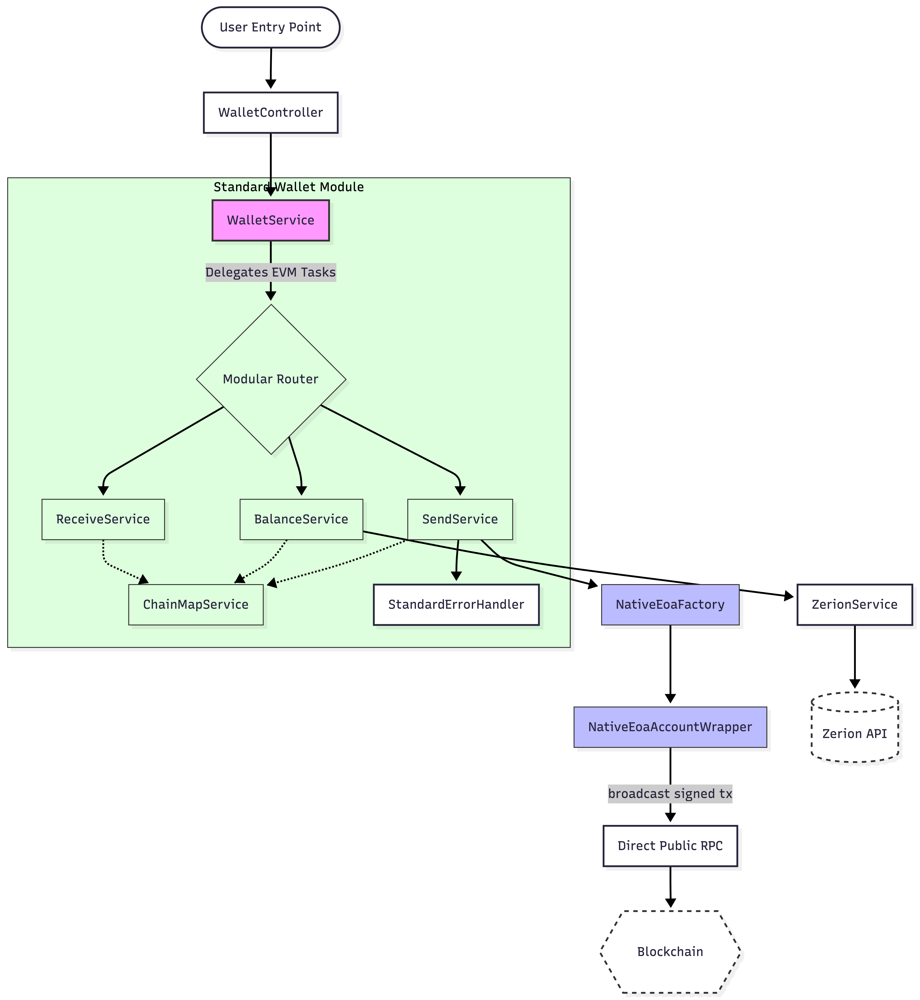

# Standard EVM Wallet Architecture

This directory implements the modular architecture for standard (non-gasless) EVM wallet operations. It is designed to be highly decoupled, allowing for easy migration between standard RPC transactions and EIP-7702 gasless flows.

## Architecture Flow

## Component Breakdowns

| Service | Responsibility |
| :--- | :--- |
| **ChainMapService** | The "Single Source of Truth" for mapping internal chain monikers to both Zerion IDs and numeric EVM Chain IDs. |
| **BalanceService** | Orchestrates balance fetching via Zerion and provides helper methods like `hasSufficientBalance`. |
| **SendService** | Manages the native/ERC20 transfer lifecycle: Account derivation -> Local signing -> Broadcast. |
| **ReceiveService** | Generates metadata for deposit addresses, including EIP-681/831 compatible QR strings. |
| **ErrorHandler** | Translates opaque RPC/Blockchain errors into structured NestJS Exceptions. |

## Why this Architecture?

1. **Decoupling**: By isolating EVM logic into its own module, the core `WalletService` remains thin and generic.
2. **Predictability**: Standard RPC transactions ensure the wallet always works on Mainnet, regardless of developer sponsorship balances.
3. **Reversibility**: This structure perfectly mirrors the EIP-7702 architecture, allowing for a 5-minute "hot-swap" back to gasless transactions by simply changing the router targets in `WalletService`.
